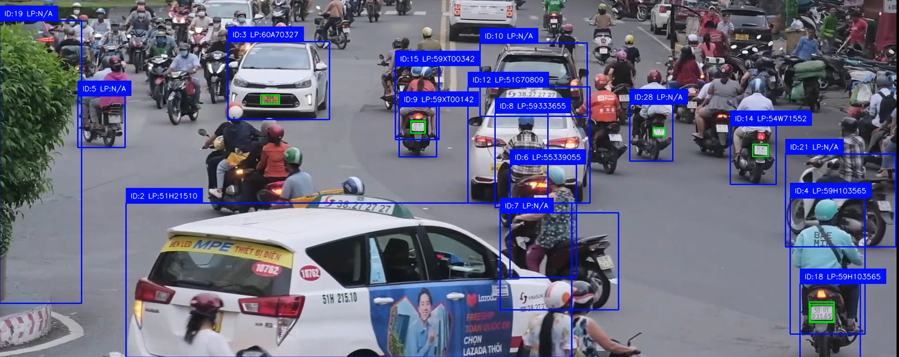
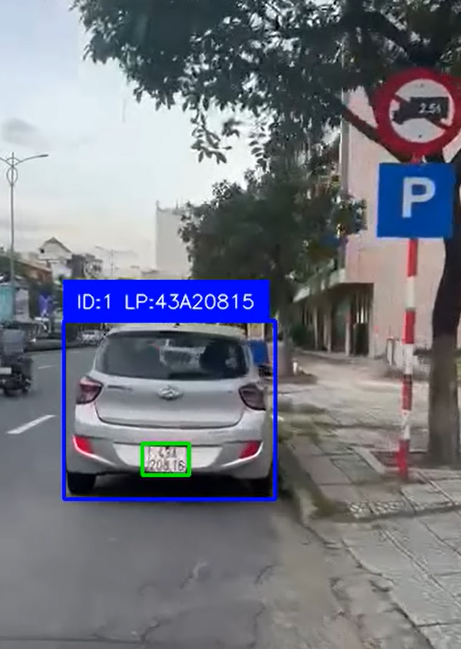
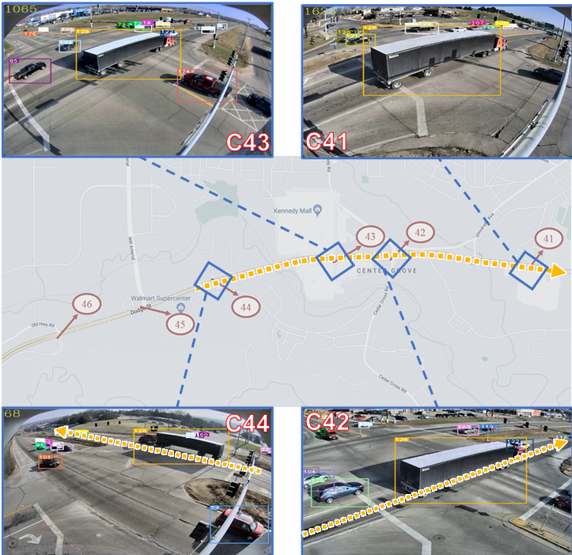

# Tdetectors - Smart City Systems

This project is a part of the Tdetectors initiative, which aims to enhance smart city systems through advanced detection and tracking technologies.
The project is contributed by:
- Nguyễn Duy Thái (N22DCCN077)
- Trần Nguyễn Sơn Thành (N22DCCN078)
- Cao Duy Thái (N22DCCN076)

## Demo

[](https://www.youtube.com/watch?v=AktD6WMdBYs)

[](https://www.youtube.com/watch?v=Z6NlvcCQByA)



### **Project Overview: Multi-Camera Vehicle Tracking with OpenVINO™**

This project implements a robust **Multi-Camera Multi-Object Tracking (MC-MOT)** system designed to detect, track, and re-identify vehicles across a wide network of traffic cameras, with a specific focus on the environment of Ho Chi Minh City.

The primary goal is to solve the vehicle re-identification (Re-ID) challenge: assigning a consistent, unique ID to each vehicle and tracking its trajectory as it moves between different camera views.

A key achievement of this project is the successful optimization of the entire AI pipeline using **Intel's OpenVINO™ Toolkit**. This resulted in a breakthrough performance increase, transforming a slow, non-real-time model into a high-performance system capable of processing video streams efficiently on standard CPU hardware.

### **Technologies Used**

Our system integrates several state-of-the-art models and tools to build a complete end-to-end pipeline:

*   **Intel® OpenVINO™ Toolkit:** The core of our optimization strategy. Used to convert and accelerate our PyTorch models, achieving a nearly **90x increase in inference speed** (from 0.17 FPS to 15.23 FPS) on a CPU.
*   **Vehicle & License Plate Detection (YOLOv12):** A high-performance object detection model used to accurately locate vehicles and their corresponding license plates in each video frame.
*   **License Plate Recognition (Compact Convolutional Transformer - CCT):** A powerful transformer-based model is used for Optical Character Recognition (OCR) to read the characters from the detected license plates.
*   **Vehicle Re-Identification (Multi-Branch Representation Learning):** A sophisticated deep learning model that generates a unique and robust feature vector (embedding) for each vehicle. This embedding captures appearance details (like color and model type) and is crucial for matching vehicles across different camera views and conditions.
*   **Tracking Algorithm (BoT-SORT):** A state-of-the-art real-time tracker that associates detections across consecutive frames. It intelligently combines motion prediction (using a Kalman Filter) with appearance features (our Re-ID embeddings) to maintain stable tracks, even during temporary occlusions.


## Installation

Provide instructions on how to set up the project environment and install dependencies.

```bash
# Example:
pip install -r requirements.txt
```

## Usage

```bash
# Example for single video getting Vehicle and License Plate Detection :
python output/Vehicle_and_License.py --source="exp.mp4" 
# The result will be automatically saved in the `output` folder.
```

At this time, because of the video livestream is not supported, so we could only cluster from the images.
```bash
# Example for getting cluster image from 2 hours of video of traffic in Ho Chi Minh City:
python models/ReID/cluster_from_camera_hcm.py
```


## Contributing

Pull requests are welcome. For major changes, please open an issue first to discuss what you would like to change.

Please make sure to update tests as appropriate.

## License

[MIT](https://choosealicense.com/licenses/mit/)

